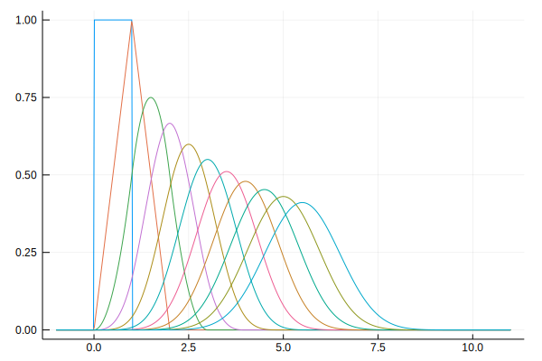
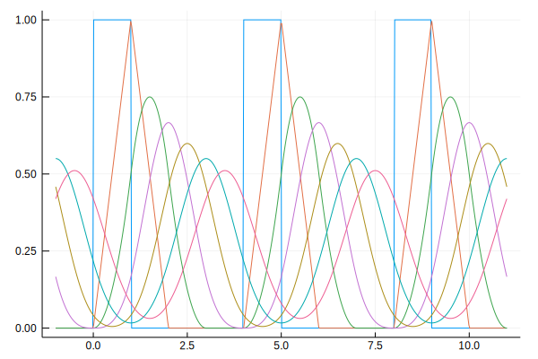

 
 
 # CardinalBSplines

**A Julia package for B-splines operations**

| **Documentation** | **Build Status** | **Coverage** |
|-------------------|------------------|--------------|
| 
  
| 
  
| 
   |

Installation instructions and full functionality can be found in the [documentation](https://vincentcp.github.io/CardinalBSplines.jl/dev)

# Examples  

#### The B-splines of order 0 to 10,

#### The periodic, centered B-splines of order 0 to 10 with period 4.

#### The 0th to 4th derivative of the periodic B-spline of order 4 with period 3.

