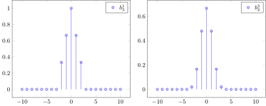
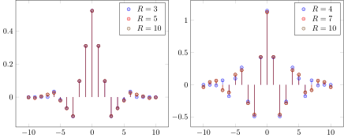

# Filters
The packages supports discrete B-splines as defined by

*B-Spline Signal Processing: Part I`Unser et al.,
IEEE TRANSACTIONS ON SIGNAL PROCESSING, VOL. 41, NO. 2*

$$b^n_m(k) = \beta^n(k/m)$$

In the figure below we show two examples of such discrete B-splines, namely, $$b^1_3$$ and $$b^3_2$$


[\[.pdf\]](figs/discretespline.pdf), [\[generated .tex\]](figs/discretespline.tex), [\[generated .tikz\]](figs/discretespline.tikz)




For oversampled discrete B-splines ($$m>1$$) there exist compact duals, i.e., signals, $$g$$, such that

$$\langle \delta_{lm} * b^n_m, \delta_{km} * g\rangle=\delta_{l-k},\quad \forall l,k\in \mathbb Z.$$

Their support is restricted to $$k=-R,\dots,R$$. Below you see some compact dual signals for the discrete B-splines above.

[\[.pdf\]](figs/compact_dual.pdf), [\[generated .tex\]](figs/compact_dual.tex), [\[generated .tikz\]](figs/compact_dual.tikz)



```@autodocs
Modules = [CardinalBSplines]
Pages   = ["filters.jl"]
```
